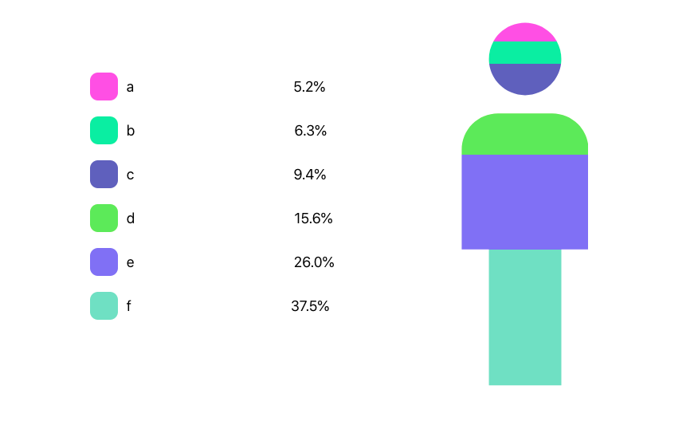

# React Human Chart

> A simple human chart made with create-react-app that displays percentages of input data.

## Table of Contents

- [General Info](#general-information)
- [Technologies Used](#technologies-used)
- [Screenshots](#screenshots)
- [Setup](#setup)
- [Usage](#usage)
- [Room for Improvement](#room-for-improvement)
- [Acknowledgements](#acknowledgements)
- [Contact](#contact)
<!-- * [License](#license) -->

## General Information

- The HumanChart component receives an input dataset and a dataKey to calculate the percentages of these data on the human chart

## Technologies Used

- Typescript - version 4.1.2
- React - version 17.0.2

## Screenshots

<!-- If you have screenshots you'd like to share, include them here. -->

## Setup

Install the library using
`npm i react-human-chart`

## Usage

How to use it?

We import the library normally in our component

`import { HumanChart } from "react-human-chart"`

We provide the component with these props

| prop         | type                                  | required | description                                                                                                                                                                                                                                                                 |
| ------------ | ------------------------------------- | -------- | --------------------------------------------------------------------------------------------------------------------------------------------------------------------------------------------------------------------------------------------------------------------------- |
| dataKey      | string                                | Yes      | The name of the key in the input dataset to calculate the percentages from. Its value can be a numeric string or a number.                                                                                                                                                  |
| labelKey     | string                                | No       | The name of the key in the input dataset for the value labels of each percentages. Its default value is "name".                                                                                                                                                             |
| customColors | boolean                               | No       | A flag indicating if you want to add your custom colors to each record in the dataset. For that, you have to provide a color prop to each record in the dataset containing a hex color string. Its default value is false and random colors are generated for each portion. |
| data         | { [key: string]: string \| number }[] | Yes      | The input dataset to calculate the percentages from. Its values can be numeric strings or numbers.                                                                                                                                                                          |

` <HumanChart data={data} dataKey="foo" />`

## Room for Improvement

- Multiple new animations
- Allowing for custom styles
- Responsive chart

## Acknowledgements

Give credit here.

- This project was based on [this article](https://css-tricks.com/clipping-masking-css/).

## Contact

Created by [@kizofcb](kizofcb@gmail.com) - feel free to contact me!
